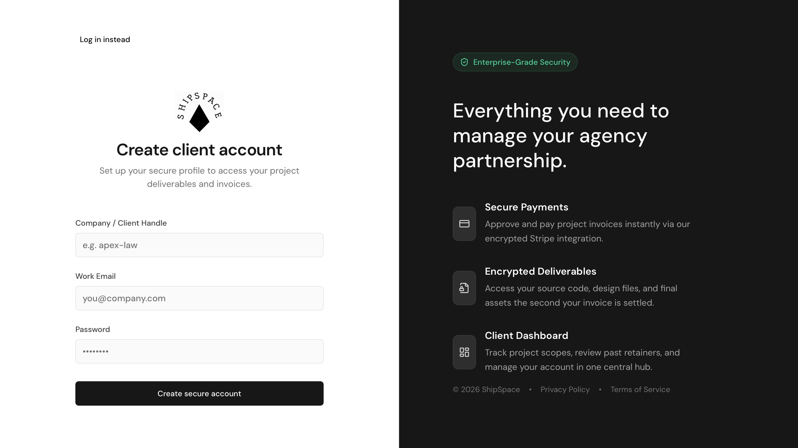

<div align="center">
  <br />
    <a href="[Insert your live ShipSpace link here]" target="_blank">
      
    </a>
  <br />

  <h1 align="center">
    ShipSpace | B2B Client Portal SaaS
  </h1>

  <p align="center">
    <strong>A production-grade, multi-tenant B2B client portal engineered for agencies.</strong>
  </p>

  <p align="center">
    <a href="[Insert your live ShipSpace link here]">View Live Demo</a>
    ·
    <a href="[Insert your GitHub link here]/issues">Report Bug</a>
  </p>
</div>

<div align="center"> 
  
  
  
  
  
  
  
  
</div>

<br />


> **Note:** This project represents an architectural pivot from a legacy multi-tenant e-commerce codebase into a specialized, high-value SaaS environment. It focuses on secure data isolation, complex state management, and premium UI architecture.

---

## 🏗️ The Architecture & Features

- 🧩 **Multi-Tenant Data Isolation** – Securely isolated environments allowing multiple agencies to manage their respective clients from a single, unified codebase.
- 🔐 **Advanced RBAC** – Sophisticated routing and auth logic distinguishing between `super-admin` (agency owners) and `user` (clients), with strict restrictions on backend Payload CMS access.
- 🗂️ **Secure Deliverables Engine** – A protected, searchable library for project assets and high-res files routed dynamically by tenant ID.
- 💳 **Centralized Billing & Invoices** – Engineered a premium SaaS billing table UI, prepared for Stripe webhook integration to manage client scopes and payments.
- ⚡ **Aggressive Cache Optimization** – Custom authentication hooks that clear server-side Payload sessions and immediately nuke the client-side React Query cache to guarantee instant UI state updates.
- 🎨 **Scalable Premium UI** – Custom design system featuring segmented control navigation, smooth transitions, and high-end rounded layouts using Tailwind CSS.

---

## 🧠 Engineering Challenges Solved

Instead of building another standard clone, I focused on the "hard" problems of product engineering:

1. **The Architecture Pivot:** Successfully decoupling generic e-commerce dynamic routes into dedicated, secure B2B views (Deliverables, Invoices, Settings) while maintaining tenant isolation.
2. **Type-Safe Full-Stack Communication:** Leveraging **tRPC** to bridge the Next.js frontend and Payload backend, completely eliminating type mismatch errors across the wire.
3. **State Synchronization:** Handling the complex edge cases of user logouts in a deeply nested React Query environment. I engineered a solution to actively purge the cache to prevent stale data leaks across accounts.

---

## 🧰 The Tech Stack

| Category | Technology |
| --- | --- |
| **Core Framework** | Next.js 15 (App Router), React, TypeScript |
| **State & Data** | tRPC, Tanstack React Query |
| **Backend & Auth** | Payload CMS, Node.js |
| **Database** | MongoDB |
| **Styling** | Tailwind CSS, Shadcn UI, Lucide Icons |
| **Payments** |	Stripe API + Webhooks |

---

## ⚙️ Local Development

### Prerequisites
- Node.js (v18+)
- Bun (or npm/yarn)

### Installation

1. **Clone the repository**
   ```bash
   git clone (https://github.com/shekhar566/ShipSpace-B2B-Client-Portal-SaaS).git
   cd shipspace-b2b-portal

2. **Install dependencies**
   
   ```bash
   bun install
3. **Set up environment variables
   Create a .env file in the root directory**:

   ```bash
   PAYLOAD_SECRET=your_secret_key
   DATABASE_URI=your_mongodb_connection_string
   NEXT_PUBLIC_ROOT_DOMAIN="localhost:3000"
   NEXT_PUBLIC_ENABLE_SUBDOMAIN_ROUTING:""
   STRIPE_SECRET_KEY=
   STRIPE_WEBHOOK_SECRET

4. **Run the development server**
   
   ```bash
   bun run dev

  Open http://localhost:3000 to view the frontend, or navigate to /admin for the Payload CMS dashboard.
